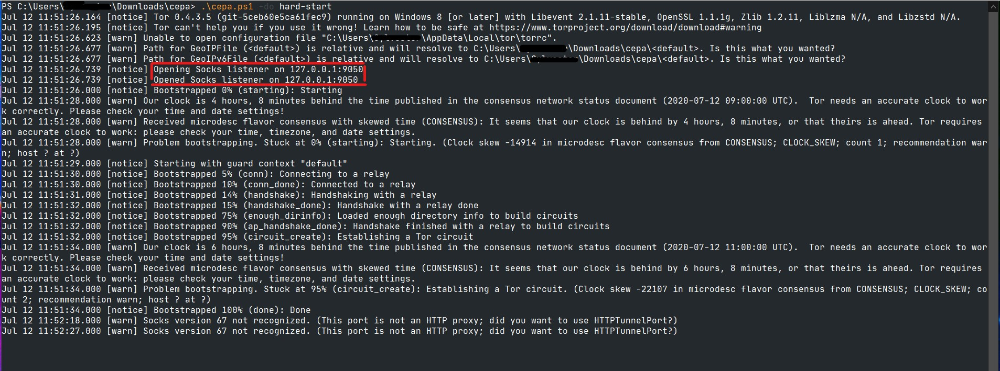

	<h1><code>cepa</code></h1>

Basically some dumb powershell scripts to run a local [tor](https://ww.torproject.org) socks proxy lmao 

# Usage
1. Clone or download the repository and extract to a folder
2. Run `powershell .\cepa.ps1 -do help` in the same folder containing the Powershell script for the help message
3. `powershell .\cepa.ps1` should download and set up the tor binary and run it

4. Now all you have to do is configure your browser or system to use the SOCKS5 proxy. 

## Note
- As the screenshot above shows, the SOCKS listener is located at 127.0.0.1:9095
- You can configure tor using a `torrc` file at `%LOCALAPPDATA%\tor`. If it isn't there, simply create the file. Refer to the [tor manual](https://2019.www.torproject.org/docs/tor-manual.html.en)
